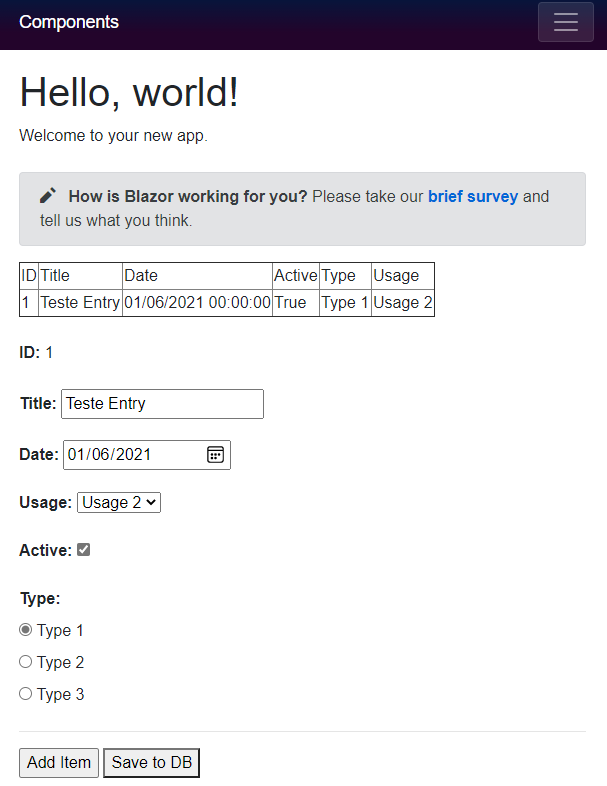

# Display of table content and small form with some inputs/controls as a example 

### Files changed/created:
* Model -> MyDataStructure.cs
* Model -> MyType.cs
* Model -> MyUsage.cs
* Controls -> LabelBold.razor
* Controls -> LabelNormal.razor
* Controls -> MyDataEdit.razor
* Pages -> Index.razor
* _Imports.razor (added using for the 2 created folders (Controls and Model) to easly add created classes/components)
